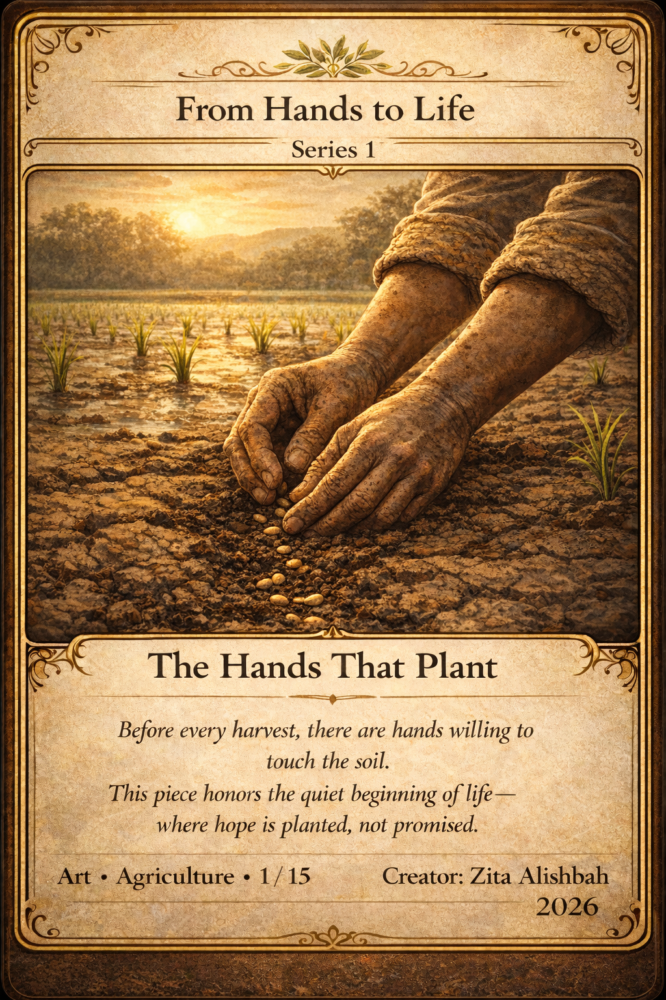
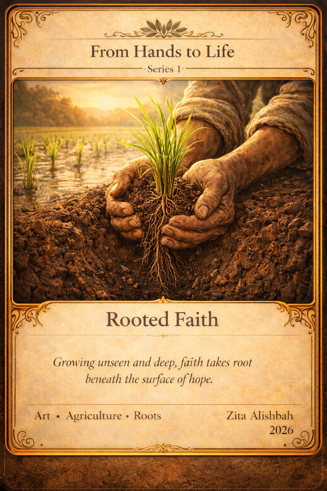
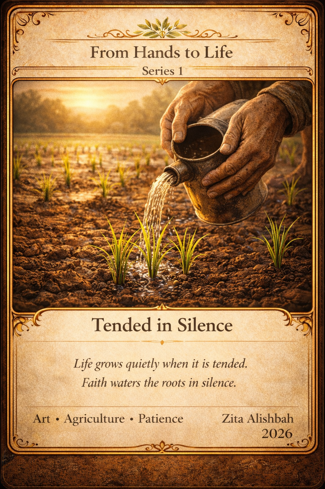
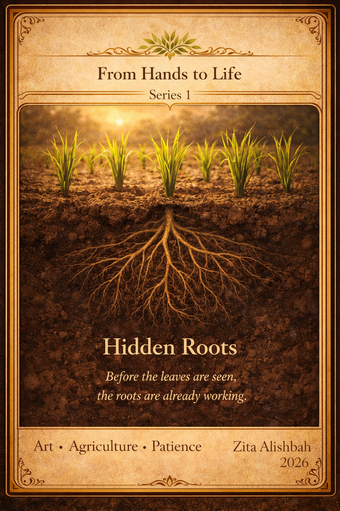
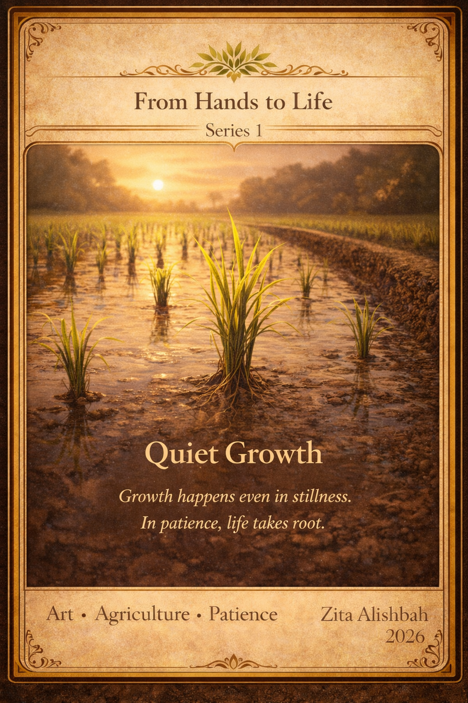
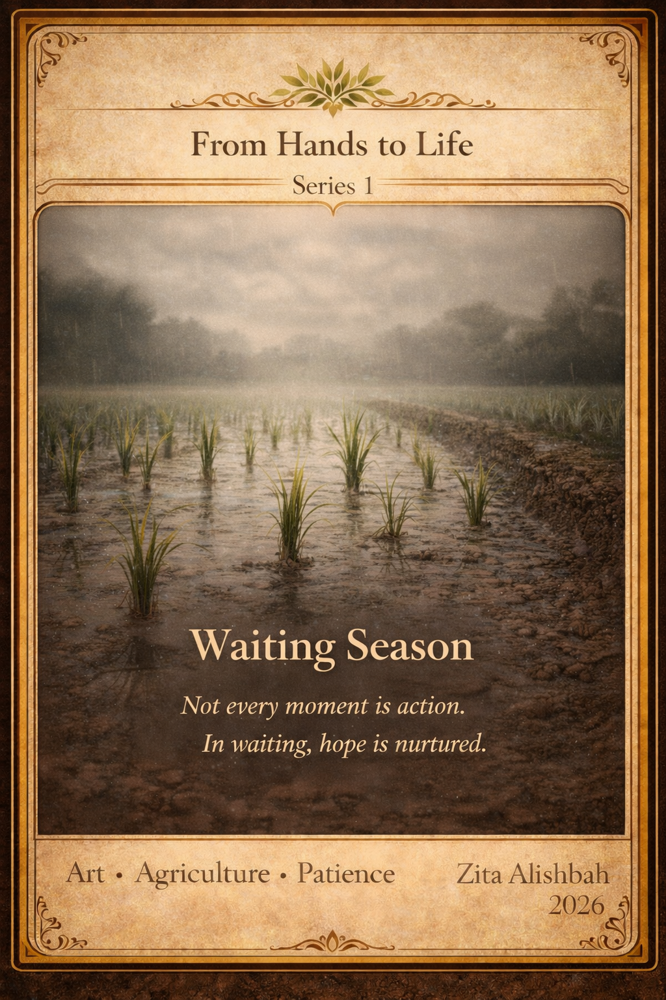

# hands-to-life
Visual art series exploring quiet growth and faith

# From Hands to Life  

Visual art series exploring quiet growth, unseen labor, and faith through rice-field symbolism.  
A quiet reflection on patience, soil, and faith.

# Bio
*From Hands to Life is a collectible art project that explores agriculture as the origin of life.Through hands, soil, and seeds, this series captures the quiet strength, hope, and patience behind every harvest.*

## Gallery Navigation
- [001 — The Hands That Plant](#001--the-hands-that-plant)
- [002 — Seeds of Hope](#002--seeds-of-hope)
- [003 — Rooted Faith](#003--rooted-faith)
- [004 — Tended in Silence](#004--tended-in-silence)
- [005 — Hidden Roots](#005--hidden-roots)
- [006 — Quiet Growth](#006--quiet-growth)
- [007 — Waiting Season](#007--waiting-season)

---
## ARTIST STATEMENT
From Hands to Life
From Hands to Life is a visual art series that reflects on quiet growth, unseen labor, and faith through the symbolism of rice fields. Each image portrays hands, soil, roots, and time—elements that often go unnoticed, yet sustain life.
This series draws inspiration from the patience required in cultivation, where progress is rarely instant and outcomes cannot be rushed. Like faith, growth happens beneath the surface long before it becomes visible. Rice, as a symbol of sustenance and humility, represents the sacred connection between human effort and natural rhythm.
From Hands to Life invites the viewer to slow down, honor small beginnings, and recognize that what is nurtured in silence often carries the greatest meaning.

## Series 1 — Gallery

### 001 — The Hands That Plant

# Description

*A semi-realistic illustration of a farmer’s hands gently placing seeds into fertile soil.The earth shows texture and life, illuminated by warm morning light.No face is shown — only hands, soil, and the moment where life begins.*
[↑ Back to Top](#from-hands-to-life)

### 002 — Seeds of Hope

# Description

*Seeds of Hope captures the quiet moment where life begins — when hands touch the soil and plant the first seed.This artwork represents hope, patience, and trust in nature’s unseen process.Before growth, before harvest, there is belief. Every seed planted is a promise, and every touch of soil is an act of faith toward the future.As part of Series 1 — The Beginning, this card continues the story of how life emerges through simple human actions, honoring agriculture as the foundation of sustainability and human survival.*
[↑ Back to Top](#from-hands-to-life)

### 003 — Rooted Faith

# Description

*Rooted Faith reveals the unseen strength beneath the surface.A young rice plant stands firmly as its roots spread deep into the soil, held carefully by weathered hands that understand patience and time.This artwork represents faith that grows quietly — not always visible, yet essential for life to continue.Just like agriculture, belief takes root long before results appear.As part of Series 1 — The Beginning, Rooted Faith follows the act of planting and the promise of seeds, reminding us that true growth begins below the surface, anchored in care, perseverance, and trust in nature.*
[↑ Back to Top](#from-hands-to-life)

### 004 — Tended in Silence

# Description 

*Growth does not always announce itself.In quiet care and unseen patience, life is shaped day by day.This piece honors the hands that remain, nurture, and believe—even when no one is watching.*
[↑ Back to Top](#from-hands-to-life)

### 005 — Hidden Roots

# Description

*Not all growth is visible.Beneath the soil, roots work in silence—strengthening, searching for water, and preparing life for what has not yet appeared.*
[↑ Back to Top](#from-hands-to-life)

### 006 — Quiet Growth

# Description

*True growth often happens without applause.Day by day, without spectacle, life continues slow, certain, and full of promise.*
[↑ Back to Top](#from-hands-to-life)

### 007 — Waiting Season

# Description

*Not every season asks for action.some seasons invite waiting allowing the rain to fall and trusting time to tend what has been planted.*

[↑ Back to Top](#from-hands-to-life)

---

## Artist & Credits
**Artist:** Zita Alishbah  
**Year:** 2026
